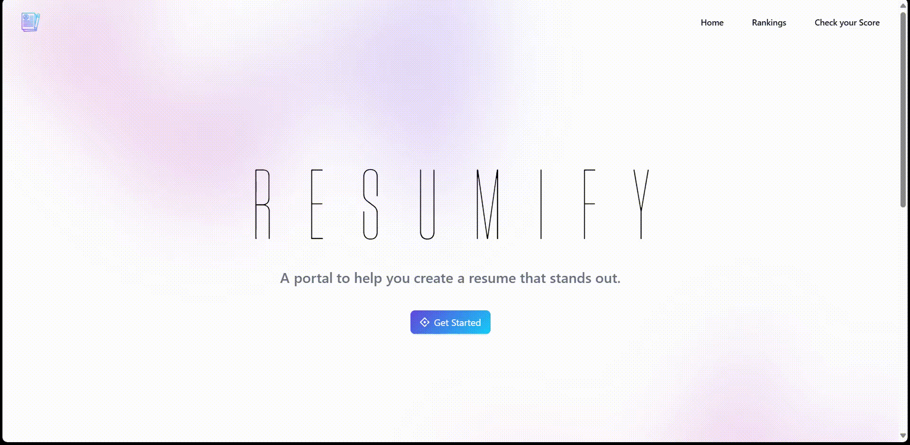

# [ResumiFy: AI-Powered Resume Screening and Ranking Portal 🚀](https://resumify.up.railway.app/)

[](https://github.com/your-github-username/your-repo-name)
[](https://opensource.org/licenses/MIT)
[](https://reactjs.org/)
[](https://www.djangoproject.com/)
[](https://ai.google.dev/)

---

  

## ✨ Overview
**ResumiFy** is an AI-powered web portal designed to streamline the resume screening process. Developed as a final year degree project, ResumiFy allows users to upload resume PDFs and receive instant AI-driven feedback, including:
- Resume score (1-10)
- Detailed review of strengths and weaknesses
- ATS (Applicant Tracking System) friendliness assessment
- Actionable improvement suggestions

This project leverages the **Google Gemini API** for intelligent resume evaluation and is built with a modern tech stack to provide a responsive and efficient user experience.

---

## 🌟 Key Features
- **Resume Upload** – Users can upload resumes in PDF format through an intuitive interface.
- **AI-Powered Analysis** – Uses Google Gemini API for comprehensive resume evaluation.
- **Scoring System** – Assigns an overall resume quality score (1-10).
- **Detailed Review** – Highlights strengths and weaknesses with actionable feedback.
- **ATS Friendliness Check** – Ensures resume compatibility with Applicant Tracking Systems.
- **Improvement Suggestions** – Provides 2-3 practical recommendations to enhance the resume.
- **Result Display** – Analysis results are presented in a clean, organized modal/popup.
- **Server Status Indicator** – Displays real-time backend server availability.
- **Responsive Design** – Ensures seamless user experience across devices.

---

## 🛠️ Tech Stack

### **Frontend:**
- [**React.js**](https://reactjs.org/) – Interactive and dynamic user interface.
- [**Node.js**](https://nodejs.org/) – JavaScript runtime environment.
- [**Axios**](https://axios-http.com/) – HTTP requests to the backend API.
- [**Vite**](https://vitejs.dev/) – Fast frontend development and build tooling.

### **Backend:**
- [**Django**](https://www.djangoproject.com/) – High-level Python web framework.
- [**Django REST Framework**](https://www.django-rest-framework.org/) – RESTful API development.
- [**Python**](https://www.python.org/) – Backend programming language.
- [**PyPDF2**](https://pypdf2.readthedocs.io/en/stable/) – Extracts text from PDFs.

### **AI & NLP:**
- [**Google Gemini API**](https://ai.google.dev/) – AI-driven resume analysis.
- [**google-generativeai Python library**](https://pypi.org/project/google-generativeai/) – API interaction library.

---

## ⚙️ Installation & Setup

### **1. Clone the Repository**
```bash
git clone [repository-url]  # Replace with your repository URL
cd ResumiFy  # Navigate to project directory
```

### **2. Backend Setup (Django)**
```bash
cd resume_ranking_backend  # Navigate to the backend folder
python -m venv venv  # Create a virtual environment
source venv/bin/activate  # Activate virtual environment (Linux/macOS)
# venv\Scripts\activate (Windows)

pip install -r requirements.txt  # Install dependencies
```

#### **Configure Environment Variables**
Create a `.env` file in `resume_ranking_backend` and add:
```ini
GEMINI_API_KEY=YOUR_GEMINI_API_KEY_HERE  # Replace with your actual API key
```

#### **Run Database Migrations**
```bash
python manage.py makemigrations resume_app
python manage.py migrate resume_app
```

#### **Start the Backend Server**
```bash
python manage.py runserver
```
Backend runs at: **http://127.0.0.1:8000/**

---

### **3. Frontend Setup (React)**
```bash
cd ../frontend  # Navigate to the frontend folder
npm install  # Install dependencies
```

#### **Configure Frontend Environment Variables**
Create a `.env.local` file in `frontend` and add:
```ini
VITE_BACKEND_API_URL=http://localhost:8000  # Backend URL
```

#### **Run Frontend Development Server**
```bash
npm run dev  # Start frontend development server
```
Frontend runs at: **http://localhost:5173/**

---

## 🚀 Usage
1. Open **ResumiFy** in your browser.
2. Upload your resume in PDF format.
3. Wait while the AI processes your resume.
4. View results in a modal:
   - Overall Score (1-10)
   - Review of strengths and weaknesses
   - ATS compatibility assessment
   - Improvement suggestions
5. Use the feedback to improve your resume!

---

## 🤝 Contributing
Contributions are welcome! Follow these steps to contribute:
1. Fork the repository.
2. Create a new branch:
   ```bash
   git checkout -b feature/your-feature-name
   ```
3. Make changes and commit:
   ```bash
   git commit -m 'Add some feature'
   ```
4. Push to your branch:
   ```bash
   git push origin feature/your-feature-name
   ```
5. Open a pull request.

Please follow the project's coding guidelines.

---

## 📜 License
This project is licensed under the [MIT License](https://opensource.org/licenses/MIT).


---

🎉 **Happy Resume Building!** 🎉

